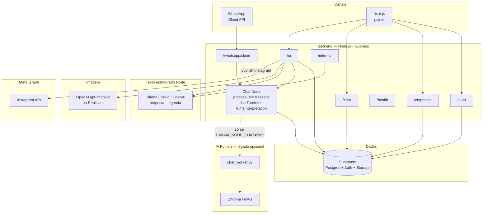
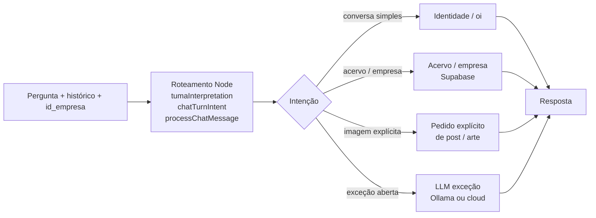
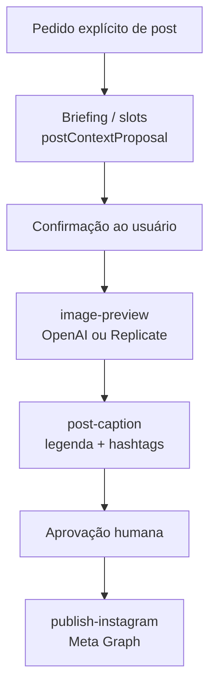

# Arquitetura do repositório (TumaIA)

Diagramas em [Mermaid](https://mermaid.js.org/) — visualizar no GitHub, VS Code ou [mermaid.live](https://mermaid.live).

Estado funcional atual: [`../stack-e-estado-atual.md`](../stack-e-estado-atual.md).

## Visão de containers

Caminho feliz: **Node-first**. WhatsApp Cloud API e painel falam com o monólito Express; chat usa regras + `processChatMessage` / `chatTurnIntent` / `tumaInterpretation`; imagem via `IMAGE_PROVIDER`; Instagram via Meta Graph no backend. Python/RAG/Chroma em `backend/ia/python/` é **legado opcional** (`TUMAIA_NODE_CHAT=false`), fora do fluxo principal.

## Pipeline de chat (caminho feliz — Node)

O worker Python (Chroma + orquestrador RAG) só entra se `TUMAIA_NODE_CHAT=false` — não é o pipeline de produto do protótipo.

## Pipeline de arte (post)

No WhatsApp, etapas equivalentes via comandos de texto (`gerar imagem`, `gerar legenda`, `publicar no instagram`).

## Rotas principais

| Área | Caminho | Auth | Papel |
|------|---------|------|--------|
| Auth | `/auth/*` | Público / JWT | Registro, login, empresa ativa |
| Empresas | `/empresas/*` | JWT | Multi-tenant, contextos, mídias, identidade |
| Chat | `/chat/*` | JWT | Conversas persistidas |
| IA | `/ia/chat`, `/post-context-proposal`, `/post-caption`, `/image-preview`, `/publish-instagram` | JWT | Fluxo completo de arte |
| WhatsApp | `/whatsapp/cloud/webhook` | Verify token Meta | Mensagens Cloud API |
| Automação | `/internal/*`, `/internal/whatsapp/message` | `x-internal-secret` | Testes, Replicate interno, legado |
| Saúde | `/health` | Público | Diagnóstico |

## Pastas do monorepo

| Pasta | Conteúdo |
|-------|----------|
| `frontend/` | App Router Next.js 16 |
| `backend/src/` | Express, serviços Node (chat, WhatsApp, IA, Instagram) |
| `backend/ia/python/` | Worker RAG legado + instruções `.txt` (prompts ainda usados pelo Node) |
| `testes/` | Testes Node |
| `docs/` | Documentação |

---

*Atualizado com base em `backend/src`, `docs/stack-e-estado-atual.md` e `docs/tcc-arquitetura.md` (pré-V2 / sem agentRuntime).*
