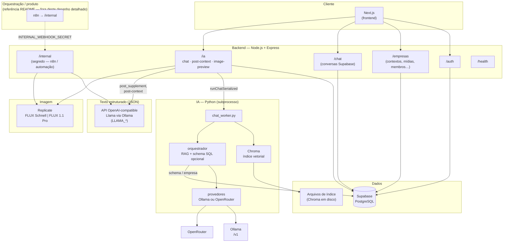
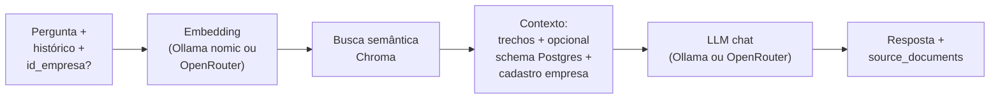

# Arquitetura do repositório (TumaIA)

Diagramas em [Mermaid](https://mermaid.js.org/) — visualizar no GitHub, no VS Code (extensão Mermaid) ou em [mermaid.live](https://mermaid.live).

## Visão de containers (o que existe no código hoje)

## Pipeline RAG (mensagem → resposta)

## Rotas principais (referência rápida)

| Área | Caminho | Papel |
|------|---------|--------|
| Auth | `/auth/*` | Registro/login (Supabase) |
| Multi-tenant | `/empresas/*` | Empresas, contextos, mídias |
| Chat persistido | `/chat/*` | Conversas no Supabase |
| IA painel | `/ia/chat`, `/ia/post-context-proposal`, `/ia/image-preview` | RAG + extras; imagem Replicate |
| Automação | `/internal/*` | Webhooks n8n; Llama JSON; FLUX; usage |

---

*Gerado a partir da estrutura em `backend/src`, `backend/ia/python` e `backend/README.md`. Ajuste o diagrama se novos serviços entrarem no repositório.*
