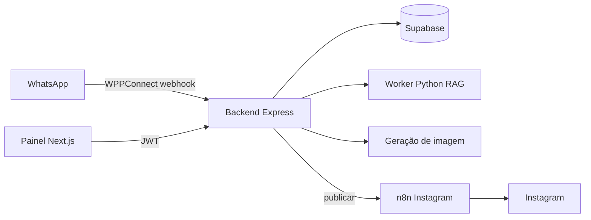

# Contexto de produto do TumaIA

## O que o TumaIA é

TumaIA é um SaaS voltado para PMEs que precisam manter presença ativa no Instagram sem depender de um fluxo manual de criação. A proposta central é transformar pedidos simples — principalmente pelo **WhatsApp** — em posts prontos para aprovação e publicação.

O produto é **WhatsApp-first**: o canal principal de entrada para o usuário final é a conversa. O **painel web** existe como retaguarda para configurar marca, catálogo, mídias, contextos e revisar o fluxo de arte.

## Problema que o produto resolve

Pequenas e médias empresas normalmente sofrem com:

- falta de tempo para criar posts com frequência;
- dificuldade de manter padrão visual e textual;
- dependência de alguém interno para legenda, hashtags e arte;
- atraso entre a ideia de campanha e a publicação real.

O TumaIA reduz esse atrito automatizando a cadeia entre pedido, geração, aprovação e publicação.

## Fluxo principal (como está no código hoje)

1. O usuário pede um post no **WhatsApp** ou no **painel** (chat).
2. O sistema identifica a **empresa** (telefone + workspace ativo no WhatsApp; JWT + `id_empresa` no painel).
3. Consulta **contexto da marca** no Supabase: identidade, campanhas, mídias do acervo.
4. A **Tuma** (IA) conversa, monta briefing e **proposta de post** quando o pedido é explícito.
5. O usuário confirma e pede **gerar imagem** → provedor configurado (OpenAI gpt-image-2 ou Replicate).
6. Gera **legenda e hashtags** alinhadas ao pedido e à marca.
7. Usuário aprova ou pede ajustes (comandos no WhatsApp ou UI no painel).
8. **Publicação no Instagram** via webhook n8n (quando configurado).

> **Nota:** O fluxo pode passar por n8n em produção para WhatsApp oficial ou orquestração extra. Em desenvolvimento, o caminho direto **WPPConnect → backend** já está implementado.

## Exemplo de pedido

`Post de camiseta azul para promoção de inverno, tom moderno e hashtags para público jovem.`

O valor está em enriquecer o pedido com o **contexto já cadastrado** (cores, logo, produtos em Mídias, modelos de post) antes de chamar a IA.

## Papel de cada parte

### WhatsApp

Canal principal de solicitação e entrega. Comandos de texto (`gerar imagem`, `gerar legenda`, `publicar no instagram`). Exige usuário cadastrado com o mesmo telefone e empresa ativa no painel.

### Painel Next.js

Cadastro, identidade de marca, acervo de mídias, chat persistido, fluxo visual de arte (briefing, prévia, legenda, publicar).

### Backend Express

Autenticação, multi-tenant, rotas `/ia`, `/chat`, `/empresas`, webhooks `/internal` e `/wppconnect`, orquestração Node + subprocesso Python.

### Supabase

Fonte de verdade: empresas, usuários, contextos, mídias, conversas, storage de imagens geradas.

### IA (Tuma)

- **Chat conversacional** — worker Python com RAG (Chroma + Ollama por padrão).
- **Roteamento de intenção** — Node decide conversa vs fluxo de arte (`tumaInterpretation`, `processChatMessage`).
- **Proposta e legenda** — serviços Node com LLM (Ollama / Replicate / OpenAI conforme env).
- **Imagem** — OpenAI ou Replicate, com referências do acervo quando aplicável.

### n8n

Opcional: automação externa, publicação Instagram (`N8N_INSTAGRAM_WEBHOOK_URL`), integrações que usam `/internal/*`.

## O que outra IA deve assumir

- Não é só gerador de imagem: é fluxo de marketing para Instagram.
- WhatsApp é canal principal; painel configura e mantém contexto.
- **Aprovação** faz parte do fluxo — não publicar sem confirmação.
- Contexto de marca é central para qualidade.
- Detalhes técnicos atuais: [`stack-e-estado-atual.md`](./stack-e-estado-atual.md).

## Implementação vs visão de produto

O repositório evolui com provedores e experimentos (FLUX legado, múltiplos `TEXT_PROVIDER`). Ao codar:

- use [`stack-e-estado-atual.md`](./stack-e-estado-atual.md) para o que **existe**;
- use este documento para o **porquê** de produto;
- quando houver divergência, documente ambos explicitamente.
