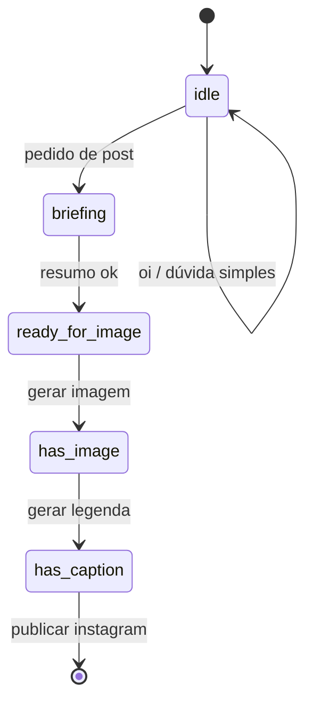

# Arquitetura alvo — TCC e piloto (1 empresa)

Documento de **decisões fechadas** para o TumaIA como protótipo de TCC e piloto com uma PME (~10–20 contatos no WhatsApp). Complementa [`stack-e-estado-atual.md`](./stack-e-estado-atual.md) (o que existe hoje) com **para onde vamos**.

---

## Visão em uma frase

**Site = repositório da marca.**  
**WhatsApp = canal do pedido.**  
**Backend Node = cérebro do fluxo (monólito).**  
**Instagram = Meta Graph no backend após aprovação.**  
**LLM = camada de exceção** — não o motor de cada mensagem.

**Núcleo do produto:**

```
Pedido no WhatsApp → contexto da marca (Supabase) → briefing → arte → legenda → aprovação → Instagram
```

O TumaIA **não precisa ser** um chatbot genérico com RAG. O desenho alvo é um **workflow de pedido** com interpretação em camadas.

---

## Infraestrutura alvo (VPS)

```text
┌─────────────────────────────────────────────────────────┐
│                        VPS                              │
│  ┌──────────────┐  ┌──────────────┐                     │
│  │ Backend Tuma │  │ WhatsApp     │                     │
│  │ (Node 24h)   │  │ Cloud API    │                     │
│  └──────┬───────┘  └──────┬───────┘                     │
│         │                 │                             │
│         └──── webhook Meta ─────────────────────────────┤
│              (chat + publicar Instagram via Graph)      │
└─────────────────────────────────────────────────────────┘
                              │
                    ┌─────────┴─────────┐
                    │ Supabase (free)   │
                    │ empresa, mídias,  │
                    │ identidade, auth  │
                    └───────────────────┘
```

| Componente | Papel | Quando liga |
|------------|-------|-------------|
| **Backend Node** | Conversa, estados, briefing, arte, legenda, Instagram | Sempre |
| **WhatsApp Cloud API** | Entrada/saída WhatsApp (Meta) | Sempre |
| **Supabase** | Dados da marca, auth, storage de imagens | Sempre |
| **Ollama / LLM** (opcional na VPS) | Perguntas complexas, legenda criativa | Só quando regras não resolvem |

---

## Fases de implantação

| Fase | WhatsApp | Instagram | LLM / RAG |
|------|----------|-----------|-----------|
| **TCC (protótipo)** | Cloud API + backend | Meta Graph no backend | Regras + painel; LLM mínima |
| **Piloto (1 empresa)** | Cloud API | Meta Graph | Mesma lógica; LLM opcional |

### Aquecimento do número (10–20 pessoas)

- Opt-in: convidar testers, não disparo em massa.
- Ideal que a **pessoa mande a primeira mensagem**.
- Subir volume aos poucos (3–5 → 10–20).
- Preferir **Cloud API** (oficial) em vez de clientes não oficiais.

---

## Runtime: monólito Node (sem Python no produto)

### Situação hoje

```text
Node (Express)  ← API, WhatsApp, briefing, legenda, imagem
     │
     └── subprocesso Python  ← chat RAG (Chroma + orquestrador)
```

### Alvo

**Um único runtime Node** na VPS — sem `pip`, sem Chroma, sem boot longo do worker Python.

| Camada | Hoje | Alvo TCC / VPS |
|--------|------|----------------|
| WhatsApp | Pode cair no Python | **Nunca** Python |
| Briefing do post | Node (`POST_CONTEXT_USE_LLAMA=false`) | Node |
| Legenda / imagem | Node → Ollama ou API | Node |
| Chat do painel | Node → Python RAG | Node (regras + Ollama HTTP) |
| Perguntas complexas | Python RAG | Node → Ollama (prompt curto) |

A **LLM continua** onde fizer sentido; o que sai é o **subprocesso Python + RAG vetorial** no caminho crítico.

### Migração em 3 passos

1. **Fase 1** — WhatsApp nunca chama Python (`TUMAIA_WHATSAPP_FAST_PATH` / `TUMAIA_NODE_CHAT`).
2. **Fase 2** — Painel no mesmo motor Node (`TUMAIA_NODE_CHAT=true`, padrão do protótipo).
3. **Fase 3** — Remover ou arquivar `backend/ia/python/`; deploy VPS = Node + Ollama.

Espelhos Node já existentes (não recomeçar do zero):

| Python (legado) | Node |
|-----------------|------|
| `interpretacao.py` | `backend/src/services/tumaInterpretation.js` |
| `identidade.py` | `backend/src/services/chatIdentityResponse.js` |
| Roteamento | `backend/src/services/chatTurnIntent.js` |
| Fluxo WhatsApp | `backend/src/services/whatsappInboundService.js` |

---

## Interpretação em camadas (sem RAG no hot path)

```text
Camada 1 — Determinística (Node, ~0 ms)
  • Comandos: gerar imagem, gerar legenda, publicar no instagram
  • Estados: idle → briefing → ready_for_image → has_image → has_caption
  • Respostas fixas: oi, como funciona, quem é você

Camada 2 — Interpretação + dados estruturados (Node + Supabase)
  • tumaInterpretation: pedido real vs pergunta hipotética
  • chatTurnIntent: identidade, empresa, acervo, contextos
  • Briefing: dados do painel (POST_CONTEXT_USE_LLAMA=false)
  • Produtos/campanhas/mídias sem busca vetorial

Camada 3 — LLM (último recurso)
  • Perguntas complexas fora do fluxo de post
  • Legenda criativa (opcional — pode ser template)
  • Sugestões abertas de copy
  • RAG reservado ao painel avançado ou v2 (se fizer sentido)
```

**Regra de ouro:** se a mensagem serve o fluxo de post → **não chama LLM**.  
Se foge da proposta mas ainda vale responder → **aí sim LLM**.

### Quem responde o quê

| Tipo de mensagem | Motor | LLM? |
|------------------|-------|------|
| `gerar imagem`, `publicar no instagram` | Comando fixo | Não |
| “Oi”, “como funciona?” | `chatIdentityResponse.js` | Não |
| “Quero post do whey pro feed” | `tumaInterpretation` + painel | Não (briefing) |
| “Quais campanhas ativas?” | Supabase estruturado | Não |
| “Se eu pedir um post, você ajuda?” | Regra: hipotética → conversa | Não |
| Ideia criativa / explicação aberta | Node → Ollama | Sim |
| Legenda | Template ou LLM | Opcional |
| Imagem | Provedor de imagem (job) | Modelo de imagem |

Na prática, **80–90%** das mensagens do piloto (10–20 pessoas) devem ficar nas camadas 1 e 2.

---

## Fluxo WhatsApp (máquina de estados)

Estados em `backend/src/services/whatsappSessionStore.js`:

```text
idle
  → pedido de post detectado
briefing
  → resumo confirmado
ready_for_image
  → comando "gerar imagem"
has_image
  → comando "gerar legenda"
has_caption
  → comando "publicar no instagram" → Meta Graph
```

Comandos explícitos (sem IA):

- `gerar imagem`
- `gerar legenda`
- `publicar no instagram`
- `Quero alterar a legenda: …`
- `Quero alterar a imagem: …`

Diagrama:



---

## Configuração `.env` alinhada

```env
# Briefing sem Llama (dados do painel)
POST_CONTEXT_USE_LLAMA=false

# Billing desligado no TCC (ligar só na arte, se necessário)
REPLICATE_ALLOW_BILLING=false
OPENAI_ALLOW_BILLING=false

# Instagram (Meta Graph)
INSTAGRAM_GRAPH_ACCESS_TOKEN=
INSTAGRAM_BUSINESS_ACCOUNT_ID=

# WhatsApp Cloud API
WHATSAPP_CLOUD_ENABLED=true
# WHATSAPP_CLOUD_ACCESS_TOKEN=
# WHATSAPP_CLOUD_PHONE_NUMBER_ID=

# Protótipo funcional — Node only (painel + WhatsApp)
TUMAIA_NODE_CHAT=true
# OLLAMA_FAST_CHAT_MODEL=llama3.2:1b

# A implementar
# TUMAIA_DEMO_MODE=true
```

---

## O que já existe no código

| Peça | Arquivo | Status |
|------|---------|--------|
| Interpretação de intenção | `backend/src/services/tumaInterpretation.js` | Implementado |
| Roteamento do turno | `backend/src/services/chatTurnIntent.js` | Implementado |
| Respostas instantâneas | `backend/src/services/chatIdentityResponse.js` | Implementado |
| Estados WhatsApp | `backend/src/services/whatsappSessionStore.js` | Implementado |
| Fluxo WhatsApp | `backend/src/services/whatsappInboundService.js` | Implementado |
| Briefing sem Llama | `postContextProposalService.js` | Implementado |
| Publicação Instagram | `instagramPublishService.js` | Implementado |
| Bridge WhatsApp Cloud | `whatsappBridge.js` | Implementado |
| LLM leve no Node | `chatNodeLlmLight.js` | Implementado |
| Chat Node (sem RAG) | `TUMAIA_NODE_CHAT` (padrão `true`) | Implementado |
| RAG Python | `backend/ia/python/` | Legado — fora do fluxo principal |
| `TUMAIA_DEMO_MODE` | — | Pendente |

---

## O que evitar

| Evitar | Motivo |
|--------|--------|
| RAG no WhatsApp / painel (protótipo) | Lento e pesado na VPS |
| Disparo em massa | Ban |
| Billing ao vivo na demo | Falha ou custo inesperado |
| Ollama 3b como protagonista de toda mensagem | Demo trava no notebook |

---

## Backlog técnico

| # | Tarefa | Prioridade |
|---|--------|------------|
| 1 | ~~`TUMAIA_WHATSAPP_FAST_PATH` / `TUMAIA_NODE_CHAT`~~ | Feito |
| 2 | Checklist deploy VPS (backend + Cloud API + Graph Instagram) | Alta |
| 3 | ~~Painel sem Python (Node → Ollama para exceções)~~ | Feito (`TUMAIA_NODE_CHAT=true`) |
| 4 | `TUMAIA_DEMO_MODE` (roteiro + artes pré-geradas) | Média |
| 5 | ~~WhatsApp Cloud API~~ | Feito |
| 6 | Remover `backend/ia/python/` após migração | Pós-TCC |

---

## Texto para monografia (TCC)

> O protótipo TumaIA adota uma arquitetura em camadas para automação de marketing via WhatsApp: o painel web funciona como repositório estruturado da identidade da marca (produtos, tom, mídias e campanhas); o canal WhatsApp opera como interface de pedido (Cloud API), com roteamento determinístico de intenção e máquina de estados para o fluxo transacional (briefing, geração de arte, legenda e aprovação); a publicação no Instagram ocorre via Meta Graph API no backend após confirmação do usuário. O modelo de linguagem foi reservado como camada opcional para consultas de maior complexidade semântica, com exclusão do RAG e do worker Python do caminho crítico do WhatsApp a fim de reduzir latência, custo computacional e complexidade de deploy em servidor monolítico Node.js.

---

## Referências

- Estado atual do código: [`stack-e-estado-atual.md`](./stack-e-estado-atual.md)
- Fluxo de negócio: [`contexto-produto.md`](./contexto-produto.md)
- Diagramas do repo: [`arquitetura/arquitetura-repositorio.md`](./arquitetura/arquitetura-repositorio.md)
- Regras de comportamento da IA: [`ia/regras-tuma-ia.md`](./ia/regras-tuma-ia.md)
